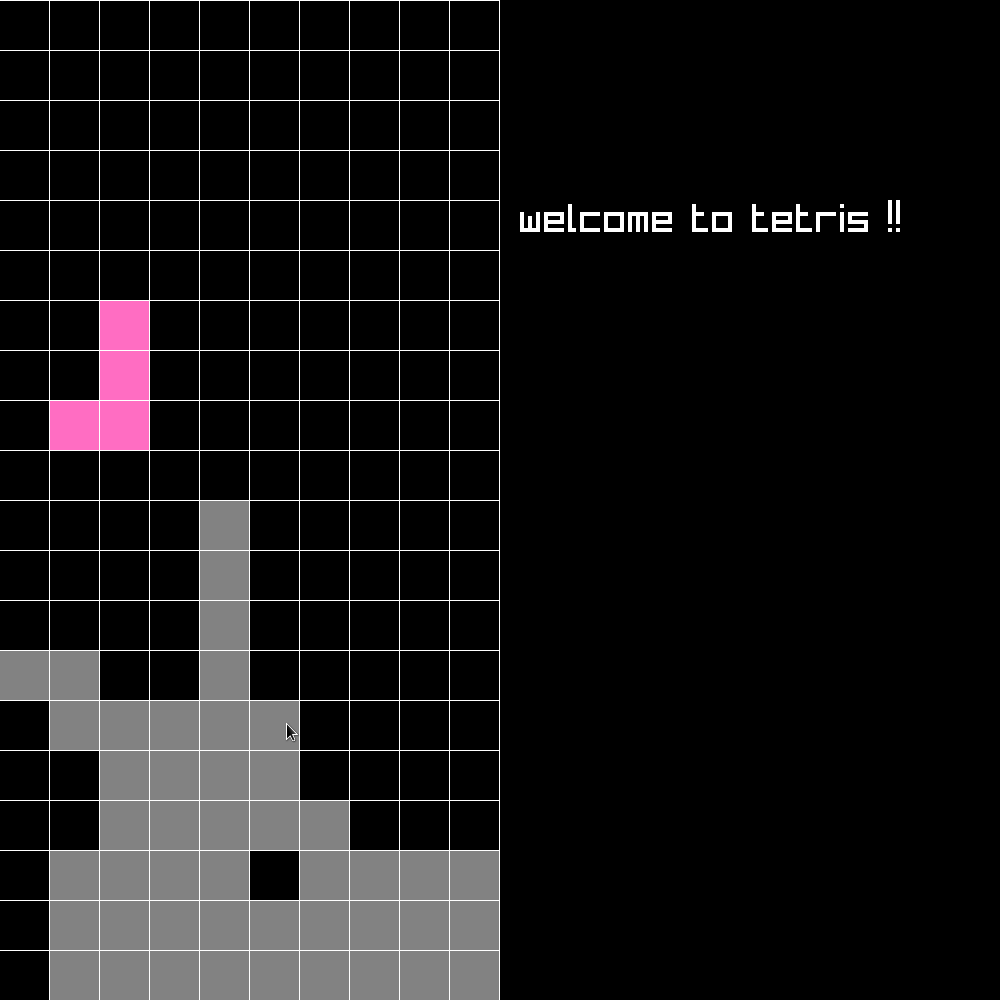

# Description
it's tetris lol

build using raylib and c11

# Installation
```bash
git clone https://github.com/imaspacecat/tetris
cd tetris
mkdir build
cd build
cmake ..
make
```

## to run:
```bash
./tetris
```


