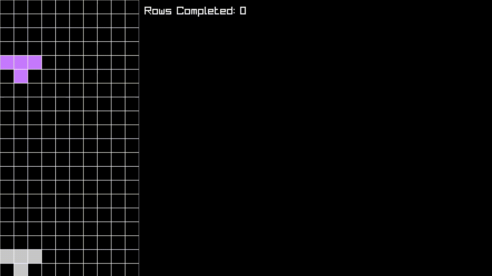

# Description
tetris

built using [raylib](https://www.raylib.com/) and C

# Installation
```bash
git clone https://github.com/imaspacecat/tetris
cd tetris
mkdir build
cd build
cmake ..
make
```

## to run:
```bash
./tetris
```


